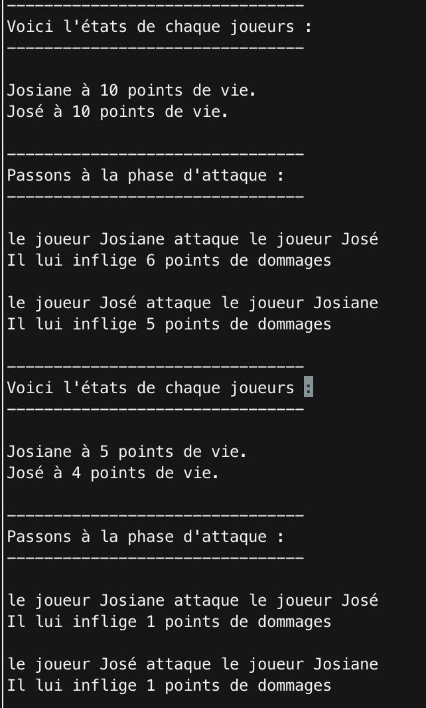
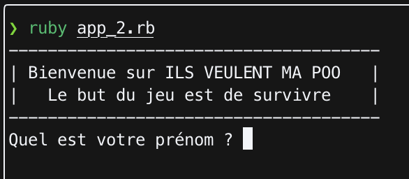
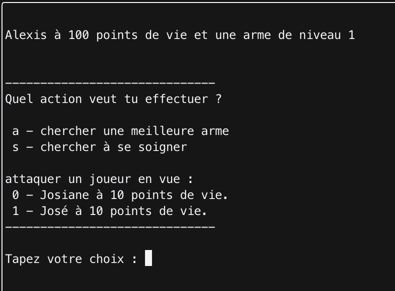

# Project - 18/10/2022 - Week 4 - Day 2 / Validant

The objectives of the day is to create a video games using Oriented Object Programmation.  

## Version 1 - Learning the OOP

You will find in the "app.rb" all the code connecting the different lib created.  

## Version 2 - Creating user interactions, and upgrading the games

View of the menu  
  

View of the action part  
  

You will also find in the "app_2.rb" the version 2, which include, a menu, user interaction, and different updgrade. 
